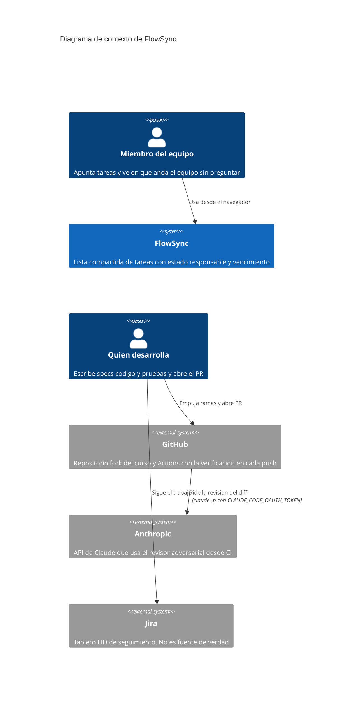
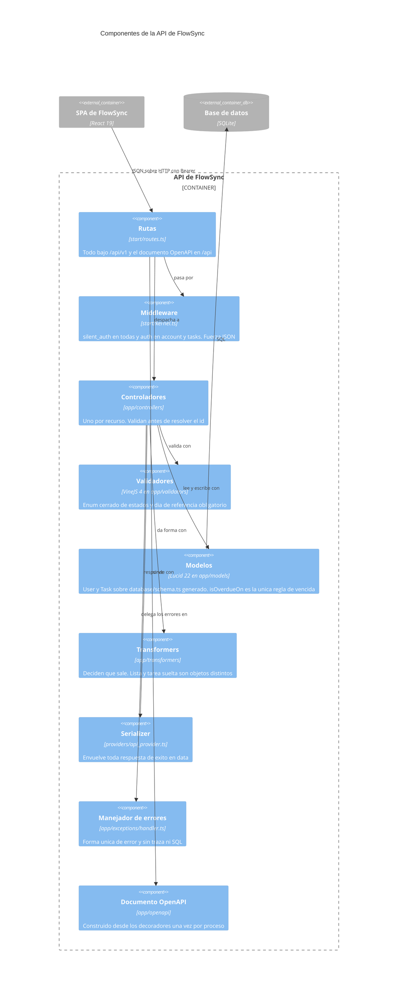
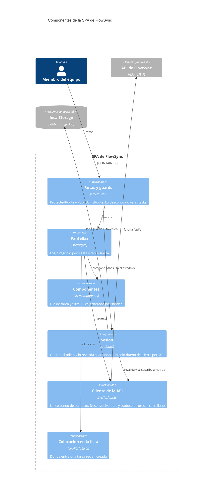
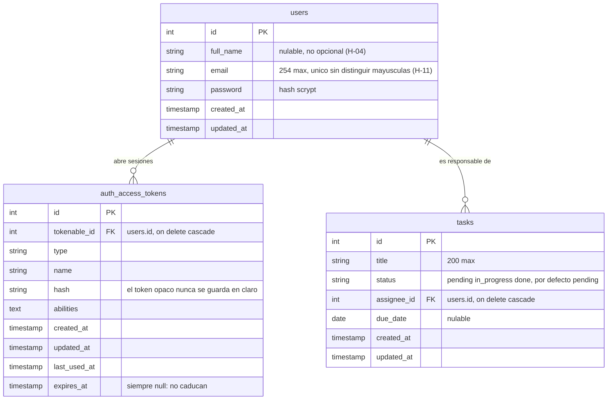

# Arquitectura de FlowSync

Tres niveles del modelo C4, de fuera hacia dentro: el **contexto** dice con quién habla FlowSync, los **contenedores** qué piezas se ejecutan por separado, y los **componentes** qué hay dentro de la API y de la SPA. Los diagramas son Mermaid dentro de este fichero, así que se versionan y se revisan en el mismo diff que el código que describen.

## Diagrama de contexto

FlowSync en ejecución no depende de ningún sistema externo: ni correo, ni pasarelas, ni almacenamiento ajeno. Lo que sí tiene alrededor es su **ciclo de desarrollo**, y se dibuja aparte porque falla de otra forma: si GitHub o Anthropic no responden, FlowSync sigue funcionando y lo que se para es la verificación.

## Diagrama de contenedores

El diagrama muestra las piezas de FlowSync que se ejecutan por separado y cómo hablan entre
sí: la SPA de React que corre en el navegador, la API de AdonisJS que escucha en el puerto
3333, el fichero SQLite donde vive todo el estado, y el `localStorage` del navegador, que es
el único sitio donde persiste la sesión. Es un diagrama de contenedores, así que no entra en
los controladores, modelos ni transformers de dentro de la API: eso queda resumido debajo.
Todo lo dibujado está leído del código —`start/routes.ts`, `config/database.ts`,
`config/auth.ts`, `frontend/src/lib/api.ts` y `frontend/src/routes/app-routes.tsx`—; lo que no
se ha podido verificar leyendo ficheros no aparece.

## Diagramas de componentes

### Dentro de la API

El camino de una petición, de la ruta a la base y de vuelta. Las flechas son dependencias leídas de los imports, no llamadas en tiempo de ejecución.

### Dentro de la SPA

## Modelo de datos

Leído de `backend/database/migrations/`, que es la única forma de cambiarlo; `database/schema.ts` se genera de ahí. Tres tablas, dos de ellas del starter de autenticación.

Lo que el esquema **no** impone y decide la aplicación: que `status` sea uno de tres (lo impone el validador con `vine.enum`, no un `CHECK`); que el email se guarde en minúsculas (lo normaliza el validador, y una migración lo hizo con lo ya guardado); y qué es «vencida», que no se almacena: se calcula al mirar. La política de migraciones, con qué se puede deshacer y qué no, en [`backend/README.md`](../backend/README.md#cambiar-el-modelo-de-datos).

## Qué hay dentro de cada contenedor

**API de FlowSync** — las cuatro capas que atraviesa cada petición, en orden:

- **Rutas** ([`backend/start/routes.ts`](../backend/start/routes.ts)), todas bajo `/api/v1`.
  Referencian a los controladores por el mapa generado en `.adonisjs/server/controllers.ts`,
  no con imports perezosos. `silent_auth_middleware` corre en todas; la protección real es
  `middleware.auth()` sobre los grupos `account` y `tasks`.

  | Método | Ruta | Controlador | Auth |
  |---|---|---|---|
  | POST | `/api/v1/auth/signup` | `NewAccountController.store` | no |
  | POST | `/api/v1/auth/login` | `AccessTokensController.store` | no |
  | GET | `/api/v1/account/profile` | `ProfileController.show` | sí |
  | POST | `/api/v1/account/logout` | `AccessTokensController.destroy` | sí |
  | GET | `/api/v1/tasks` | `TasksController.index` | sí |
  | POST | `/api/v1/tasks` | `TasksController.store` | sí |
  | GET | `/api/v1/tasks/:id` | `TasksController.show` | sí |
  | PATCH | `/api/v1/tasks/:id/status` | `TaskStatusesController.update` | sí |
  | PUT | `/api/v1/tasks/:id/due-date` | `TaskDueDatesController.update` | sí |
  | GET | `/api`, `/api.json`, `/api.yaml` | documento OpenAPI de `@foadonis/openapi` | no |

  El documento lo construye [`app/openapi/document.ts`](../backend/app/openapi/document.ts) desde
  los decoradores de los controladores, una sola vez por proceso (H-26 y H-35), y su copia
  versionada vive en [`docs/api/openapi.json`](api/openapi.json) ([ADR-0007](adr/0007-el-contrato-se-genera-se-versiona-y-se-vigila-la-deriva.md)).

- **Validadores** ([`backend/app/validators/`](../backend/app/validators/)) — VineJS 4 con
  `vine.create()`, consumidos con `request.validateUsing(...)`. `user.ts` cubre registro y
  login; `task.ts` cubre la creación, el filtro por estado, el cambio de estado, el día de
  referencia y la fecha de vencimiento.

- **Modelos** ([`backend/app/models/`](../backend/app/models/)) — `User` y `Task`. No declaran
  columnas: extienden las clases de `database/schema.ts`, que está autogenerado desde las
  migraciones. `Task` aporta la relación `belongsTo` con su responsable y la única definición
  de «vencida» del sistema (`isOverdueOn`); `User` aporta el mixin de auth, el proveedor de
  access tokens y el getter `initials`.

- **Transformers** ([`backend/app/transformers/`](../backend/app/transformers/)) — deciden qué
  sale por el cable. `UserTransformer` para la cuenta propia; `TaskTransformer` para la lista;
  `TaskDetailTransformer` para la tarea suelta, que es la única que lleva fecha de vencimiento
  y condición de vencida; y `TaskAssigneeTransformer`, que recorta el responsable a lo justo
  para identificarlo. El envoltorio `{ data: ... }` lo pone
  [`providers/api_provider.ts`](../backend/providers/api_provider.ts), que inyecta
  `ctx.serialize()` en cada `HttpContext`.

- **Errores** ([`backend/app/exceptions/handler.ts`](../backend/app/exceptions/handler.ts)) —
  toda respuesta de error sale con la forma del proyecto y sin traza, rutas ni SQL, salvo que
  se encienda el volcado de depuración a propósito (H-19, [ADR-0005](adr/0005-el-volcado-de-depuracion-va-apagado.md)).

**Base de datos** — una conexión SQLite declarada en
[`backend/config/database.ts`](../backend/config/database.ts), que **elige el fichero según el
entorno**: `tmp/db.sqlite3` en desarrollo y `tmp/db-test.sqlite3` en pruebas, con `bin/test.ts`
forzando `NODE_ENV=test` ([ADR-0003](adr/0003-aislamiento-de-la-base-de-datos-en-pruebas.md)).
Tres tablas creadas por las migraciones de [`backend/database/migrations/`](../backend/database/migrations/):
`users`, `auth_access_tokens` y `tasks`, esta última con `assignee_id` apuntando a `users` con
`onDelete CASCADE` y una `due_date` nulable. Dos migraciones más normalizan el email existente a
minúsculas y lo hacen único sin distinguir mayúsculas (H-11).

**SPA de FlowSync** — [`frontend/src/lib/api.ts`](../frontend/src/lib/api.ts) es el único punto
de contacto con el backend: envuelve `fetch`, desenvuelve el `{ data }`, adjunta el `Bearer` y
traduce los errores de VineJS a `ApiError` con mensajes en castellano y `fieldErrors` por
campo. También es quien calcula el día de referencia local que exigen las lecturas con
vencimiento. La sesión vive en [`frontend/src/auth/`](../frontend/src/auth/) y las pantallas en
[`frontend/src/pages/`](../frontend/src/pages/), enrutadas por
[`app-routes.tsx`](../frontend/src/routes/app-routes.tsx): `/login`, `/register`, `/tasks`,
`/tasks/:id`, `/profile`, y cualquier otra cosa redirige a `/tasks`.

## Lo que no está dibujado, y por qué

- **No hay sistemas externos en ejecución.** No se ha encontrado en el código ninguna integración
  con correo, pasarelas, colas ni almacenamiento externo. Los tres sistemas externos del diagrama
  de contexto -GitHub, Anthropic y Jira- son del ciclo de desarrollo, no de FlowSync corriendo.
- **El registro Tuyau de `.adonisjs/client/registry/` no es una dependencia de la SPA.** Está
  pensado para consumo tipado desde el frontend, pero hoy `frontend/src/` no lo referencia en
  ningún sitio: quien lo usa es `backend/tests/bootstrap.ts`, para tipar el `apiClient` de Japa.
  Dibujarlo como un enlace entre SPA y API sería dibujar una intención, no el código.
- **El guard `web` de sesión no se dibuja.** Está configurado en `config/auth.ts` junto al
  guard `api`, pero ninguna ruta lo usa; el `default` es `api` y toda la autenticación real va
  por access tokens opacos.
- **Los tests no son un contenedor.** Las suites de `backend/tests/`, Vitest y Playwright no se
  ejecutan en producción. Escriben en `tmp/db-test.sqlite3`, nunca en la base de desarrollo:
  lo decide `config/database.ts` por entorno y lo fija `aislamiento.spec.ts`
  ([ADR-0003](adr/0003-aislamiento-de-la-base-de-datos-en-pruebas.md)). Hasta el 2026-09-02 este
  párrafo decía lo contrario, y era cierto en la rama del curso: es H-01.
