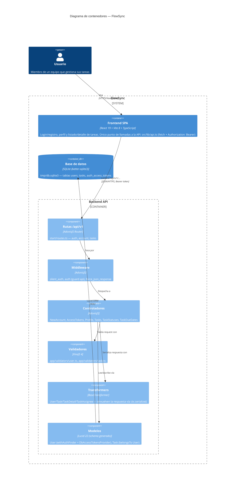

# Arquitectura — Diagrama de contenedores (C4)

Este diagrama muestra los contenedores reales del monorepo y cómo se comunican: la SPA de React (`frontend/`) consume la API AdonisJS (`backend/`) por HTTP/JSON usando `fetch` desde `src/lib/api.ts` (no se usa el cliente Tuyau generado, pese a que existe el registro `.adonisjs/client/registry/`), la API valida con VineJS, autentica con access tokens opacos (guard `api`, tabla `auth_access_tokens`) y persiste con Lucid sobre un único fichero SQLite (`tmp/db.sqlite3`). Dentro de la API se distinguen los controladores expuestos en `start/routes.ts`, los transformers que envuelven toda respuesta en `{ data: ... }`, y los modelos `User`/`Task`. Solo se dibuja lo verificado leyendo el código; no hay más contenedores (sin colas, cachés, servicios externos ni otra base de datos) en este repo.

## Rutas cubiertas (`start/routes.ts`)

| Método | Ruta | Controlador | Auth |
|---|---|---|---|
| POST | `/api/v1/auth/signup` | `NewAccountController.store` | no |
| POST | `/api/v1/auth/login` | `AccessTokensController.store` | no |
| GET | `/api/v1/account/profile` | `ProfileController.show` | sí |
| POST | `/api/v1/account/logout` | `AccessTokensController.destroy` | sí |
| GET | `/api/v1/tasks` | `TasksController.index` | sí |
| POST | `/api/v1/tasks` | `TasksController.store` | sí |
| GET | `/api/v1/tasks/:id` | `TasksController.show` | sí |
| PATCH | `/api/v1/tasks/:id/status` | `TaskStatusesController.update` | sí |
| PUT | `/api/v1/tasks/:id/due-date` | `TaskDueDatesController.update` | sí |
