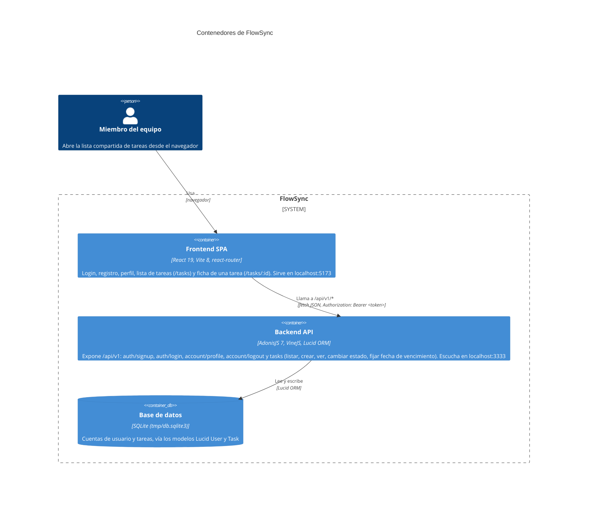

# Arquitectura

Diagrama de contenedores (nivel C4) de FlowSync, construido leyendo el código real: las
rutas de `backend/start/routes.ts`, los controladores registrados en
`backend/.adonisjs/server/controllers.ts`, la conexión SQLite de `backend/config/database.ts`,
y el punto de contacto con la API en `frontend/src/lib/api.ts`. Muestra los tres contenedores
que existen hoy — la SPA de React, la API de AdonisJS y la base de datos SQLite — y cómo se
llaman entre sí. No incluye contenedores ni integraciones que no estén implementados (no hay
cola de mensajes, caché, servicio de email ni backend distinto de este monolito).

