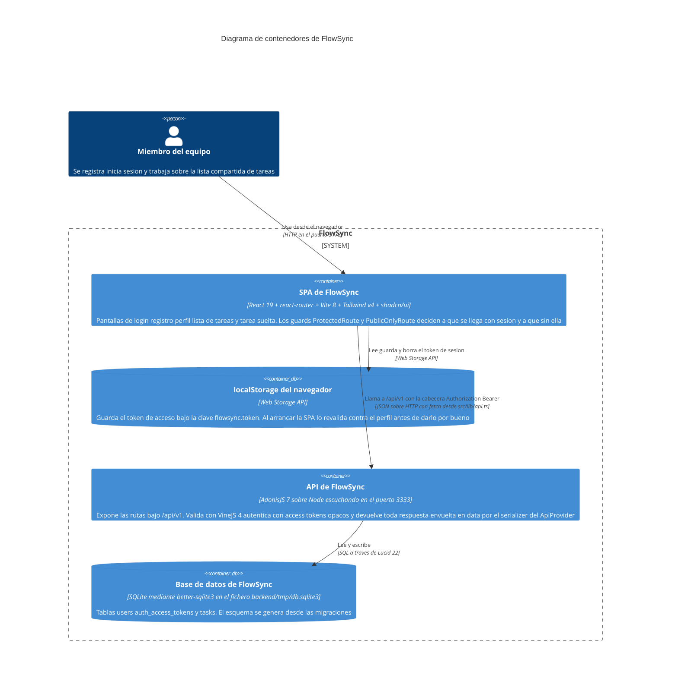

# Arquitectura de FlowSync

## Diagrama de contenedores

El diagrama muestra las piezas de FlowSync que se ejecutan por separado y cómo hablan entre
sí: la SPA de React que corre en el navegador, la API de AdonisJS que escucha en el puerto
3333, el fichero SQLite donde vive todo el estado, y el `localStorage` del navegador, que es
el único sitio donde persiste la sesión. Es un diagrama de contenedores, así que no entra en
los controladores, modelos ni transformers de dentro de la API: eso queda resumido debajo.
Todo lo dibujado está leído del código —`start/routes.ts`, `config/database.ts`,
`config/auth.ts`, `frontend/src/lib/api.ts` y `frontend/src/routes/app-routes.tsx`—; lo que no
se ha podido verificar leyendo ficheros no aparece.

## Qué hay dentro de cada contenedor

**API de FlowSync** — las cuatro capas que atraviesa cada petición, en orden:

- **Rutas** ([`backend/start/routes.ts`](../backend/start/routes.ts)), todas bajo `/api/v1`.
  Referencian a los controladores por el mapa generado en `.adonisjs/server/controllers.ts`,
  no con imports perezosos. `silent_auth_middleware` corre en todas; la protección real es
  `middleware.auth()` sobre los grupos `account` y `tasks`.

  | Método | Ruta | Controlador | Auth |
  |---|---|---|---|
  | POST | `/api/v1/auth/signup` | `NewAccountController.store` | no |
  | POST | `/api/v1/auth/login` | `AccessTokensController.store` | no |
  | GET | `/api/v1/account/profile` | `ProfileController.show` | sí |
  | POST | `/api/v1/account/logout` | `AccessTokensController.destroy` | sí |
  | GET | `/api/v1/tasks` | `TasksController.index` | sí |
  | POST | `/api/v1/tasks` | `TasksController.store` | sí |
  | GET | `/api/v1/tasks/:id` | `TasksController.show` | sí |
  | PATCH | `/api/v1/tasks/:id/status` | `TaskStatusesController.update` | sí |
  | PUT | `/api/v1/tasks/:id/due-date` | `TaskDueDatesController.update` | sí |

- **Validadores** ([`backend/app/validators/`](../backend/app/validators/)) — VineJS 4 con
  `vine.create()`, consumidos con `request.validateUsing(...)`. `user.ts` cubre registro y
  login; `task.ts` cubre la creación, el filtro por estado, el cambio de estado, el día de
  referencia y la fecha de vencimiento.

- **Modelos** ([`backend/app/models/`](../backend/app/models/)) — `User` y `Task`. No declaran
  columnas: extienden las clases de `database/schema.ts`, que está autogenerado desde las
  migraciones. `Task` aporta la relación `belongsTo` con su responsable y la única definición
  de «vencida» del sistema (`isOverdueOn`); `User` aporta el mixin de auth, el proveedor de
  access tokens y el getter `initials`.

- **Transformers** ([`backend/app/transformers/`](../backend/app/transformers/)) — deciden qué
  sale por el cable. `UserTransformer` para la cuenta propia; `TaskTransformer` para la lista;
  `TaskDetailTransformer` para la tarea suelta, que es la única que lleva fecha de vencimiento
  y condición de vencida; y `TaskAssigneeTransformer`, que recorta el responsable a lo justo
  para identificarlo. El envoltorio `{ data: ... }` lo pone
  [`providers/api_provider.ts`](../backend/providers/api_provider.ts), que inyecta
  `ctx.serialize()` en cada `HttpContext`.

**Base de datos** — una única conexión SQLite declarada en
[`backend/config/database.ts`](../backend/config/database.ts), sin override por entorno. Tres
tablas creadas por las migraciones de [`backend/database/migrations/`](../backend/database/migrations/):
`users`, `auth_access_tokens` y `tasks`, esta última con `assignee_id` apuntando a `users` con
`onDelete CASCADE` y una `due_date` nulable.

**SPA de FlowSync** — [`frontend/src/lib/api.ts`](../frontend/src/lib/api.ts) es el único punto
de contacto con el backend: envuelve `fetch`, desenvuelve el `{ data }`, adjunta el `Bearer` y
traduce los errores de VineJS a `ApiError` con mensajes en castellano y `fieldErrors` por
campo. También es quien calcula el día de referencia local que exigen las lecturas con
vencimiento. La sesión vive en [`frontend/src/auth/`](../frontend/src/auth/) y las pantallas en
[`frontend/src/pages/`](../frontend/src/pages/), enrutadas por
[`app-routes.tsx`](../frontend/src/routes/app-routes.tsx): `/login`, `/register`, `/tasks`,
`/tasks/:id`, `/profile`, y cualquier otra cosa redirige a `/tasks`.

## Lo que no está dibujado, y por qué

- **No hay sistemas externos.** No se ha encontrado en el código ninguna integración con
  correo, pasarelas, colas ni almacenamiento externo, así que el diagrama no dibuja ninguna.
- **El registro Tuyau de `.adonisjs/client/registry/` no es una dependencia de la SPA.** Está
  pensado para consumo tipado desde el frontend, pero hoy `frontend/src/` no lo referencia en
  ningún sitio: quien lo usa es `backend/tests/bootstrap.ts`, para tipar el `apiClient` de Japa.
  Dibujarlo como un enlace entre SPA y API sería dibujar una intención, no el código.
- **El guard `web` de sesión no se dibuja.** Está configurado en `config/auth.ts` junto al
  guard `api`, pero ninguna ruta lo usa; el `default` es `api` y toda la autenticación real va
  por access tokens opacos.
- **Los tests no son un contenedor.** Las suites de `backend/tests/` no se ejecutan en
  producción; conviene saber, eso sí, que pegan contra el mismo fichero SQLite que el servidor
  de desarrollo, porque `config/database.ts` no tiene override por entorno.
