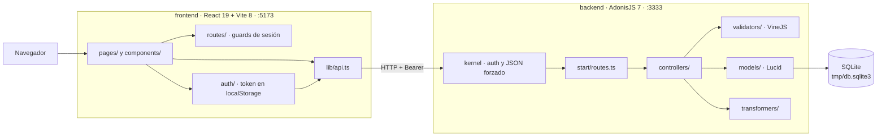
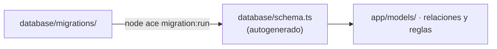
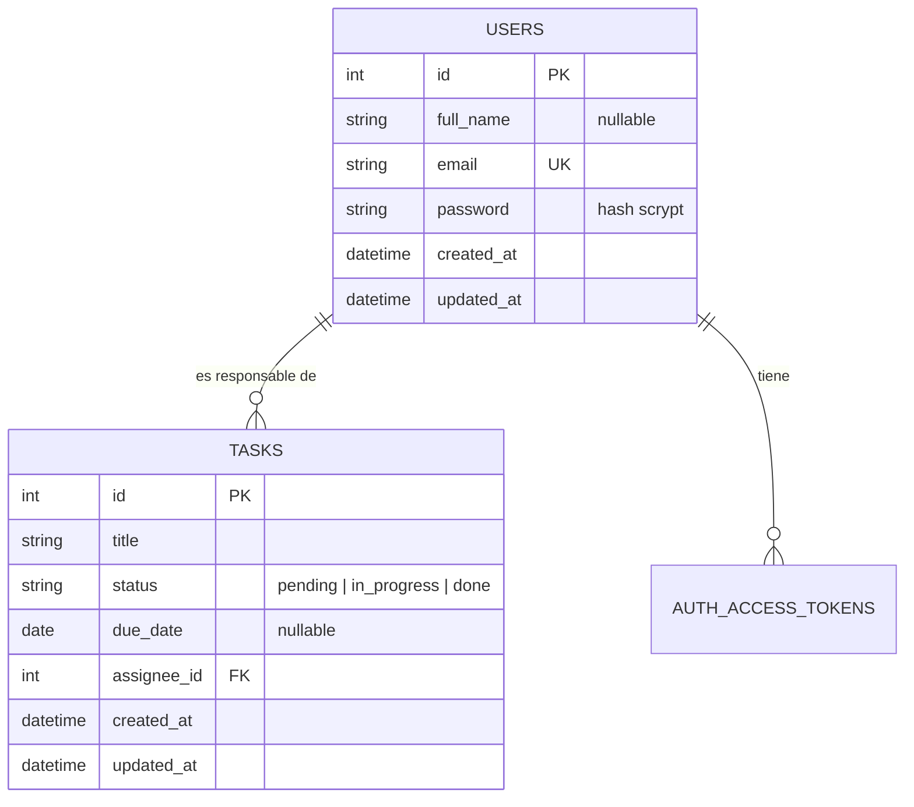
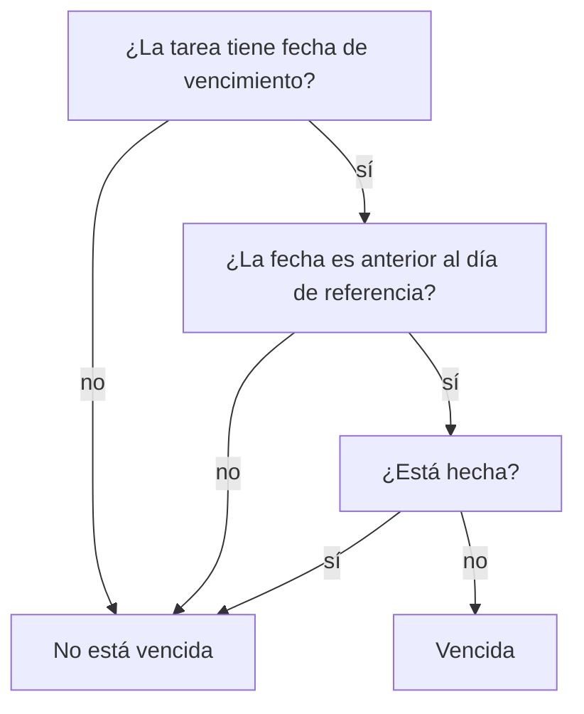
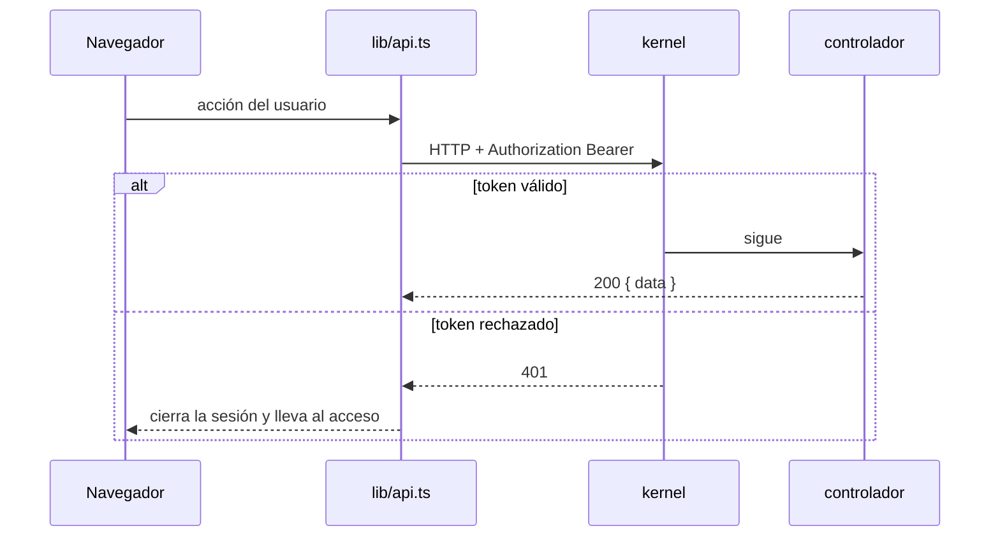
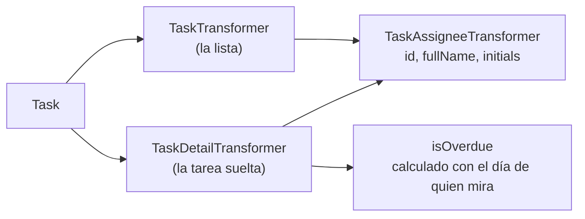

# Arquitectura

> Escrito a partir de lo que hay en el repositorio en la rama `s4/start`, no de lo que se pretendía construir. Si algo de aquí deja de ser cierto, el documento está roto y hay que arreglarlo, no ignorarlo.
>
> Última verificación: 2026-08-26.

## Las piezas

Monorepo sin workspaces: no hay `package.json` en la raíz y todos los comandos se lanzan desde `backend/` o desde `frontend/`.

Dos reglas de esta forma que no son casualidad y conviene no romper:

**`lib/api.ts` es el único punto de contacto con el backend.** Ningún componente llama a `fetch` por su cuenta. Ahí viven el desenvolvido de la respuesta, la cabecera de autorización y la traducción de los errores al castellano. Una llamada nueva se añade ahí.

**Toda respuesta pasa por `ctx.serialize()`**, que envuelve el payload bajo la clave `data`. La excepción conocida es `POST /api/v1/account/logout`, que devuelve el objeto plano.

## El esquema se genera, no se escribe

`backend/database/schema.ts` está autogenerado desde las migraciones y no se edita a mano. Los modelos **no declaran columnas**: extienden la clase generada y solo añaden relaciones y lógica.

Cambiar el modelo de datos es: crear la migración, ejecutarla para que regenere el esquema, y añadir al modelo solo lo que no es una columna.

## Datos

`status` es un conjunto cerrado declarado una sola vez en `app/models/task.ts` como `TASK_STATUSES`. El validador lo consume de ahí, así que añadir un estado es imposible sin tocar esa constante.

## La regla de negocio

Es la única regla no trivial del MVP y vive en un solo sitio, `Task.isOverdueOn()`:

Tres decisiones que están en el código y se pierden si alguien lo reescribe:

- La comparación es **estricta**: vencer hoy todavía no es estar vencida.
- El día de referencia **llega por parámetro**, nunca de un reloj del servidor. Por eso dos personas en husos distintos obtienen lecturas distintas y las dos son correctas.
- Se compara texto ISO contra texto ISO, que **es** la comparación de días del calendario: sin hora, sin huso, sin instante intermedio donde se cuele un día de más.

El frontend nunca compara fechas. Si lo hiciera, habría dos definiciones de «vencida» y una de las dos se quedaría atrás.

## Autenticación

Dos guards configurados en `config/auth.ts`; el activo es `api`, con tokens de acceso opacos. `silent_auth_middleware` corre en todas las rutas y la protección real se aplica con `middleware.auth()` sobre cada grupo.

## Superficie de la API

Cinco rutas de tareas y cuatro de cuenta, todas bajo `/api/v1`. El detalle de peticiones y respuestas está en [`api/openapi.yaml`](api/openapi.yaml).

| Método | Ruta | Sesión |
|---|---|---|
| POST | `/api/v1/auth/signup` | no |
| POST | `/api/v1/auth/login` | no |
| GET | `/api/v1/account/profile` | sí |
| POST | `/api/v1/account/logout` | sí |
| GET | `/api/v1/tasks` | sí |
| POST | `/api/v1/tasks` | sí |
| GET | `/api/v1/tasks/:id` | sí |
| PATCH | `/api/v1/tasks/:id/status` | sí |
| PUT | `/api/v1/tasks/:id/due-date` | sí |

La superficie es cerrada a propósito: no hay borrado, no hay edición de título, no hay reasignación de responsable y no hay endpoint de equipo. Esas historias están escritas en `docs/backlog/` y **no implementadas**; ver [`trazabilidad.md`](trazabilidad.md).

## Dos transformers para la tarea, y por qué

No son el mismo objeto con campos opcionales. **La lista no debe poder enseñar el vencimiento**, y la forma de garantizarlo es que el objeto que devuelve la lista no lo contenga: así el requisito deja de ser una convención que alguien tiene que recordar.

Los dos construyen el responsable con `TaskAssigneeTransformer`, que expone `id`, `fullName` e `initials` y nada más. No se usa `UserTransformer`, que incluye el email y las fechas de la cuenta. Esto no siempre fue así: la lista usaba `UserTransformer` y filtraba el email de cada responsable con la suite en verde. Está corregido y cubierto por `backend/tests/functional/tasks/assignee.spec.ts`.

## Pruebas

`backend/config/database.ts` elige el fichero de base de datos según el entorno, de modo que la suite nunca escribe sobre la base de desarrollo. Ver [ADR-0001](adr/0001-aislamiento-de-la-base-de-datos-en-pruebas.md).

Dos suites declaradas en `adonisrc.ts`: `unit` (sin ficheros todavía) y `functional`. Qué está cubierto y qué no, en [`trazabilidad.md`](trazabilidad.md).

El frontend corre **Vitest** (`npm test`), 28 pruebas sobre `src/lib/api.test.ts`, que es el único punto de contacto con el backend. No hay runner de **navegador**.
