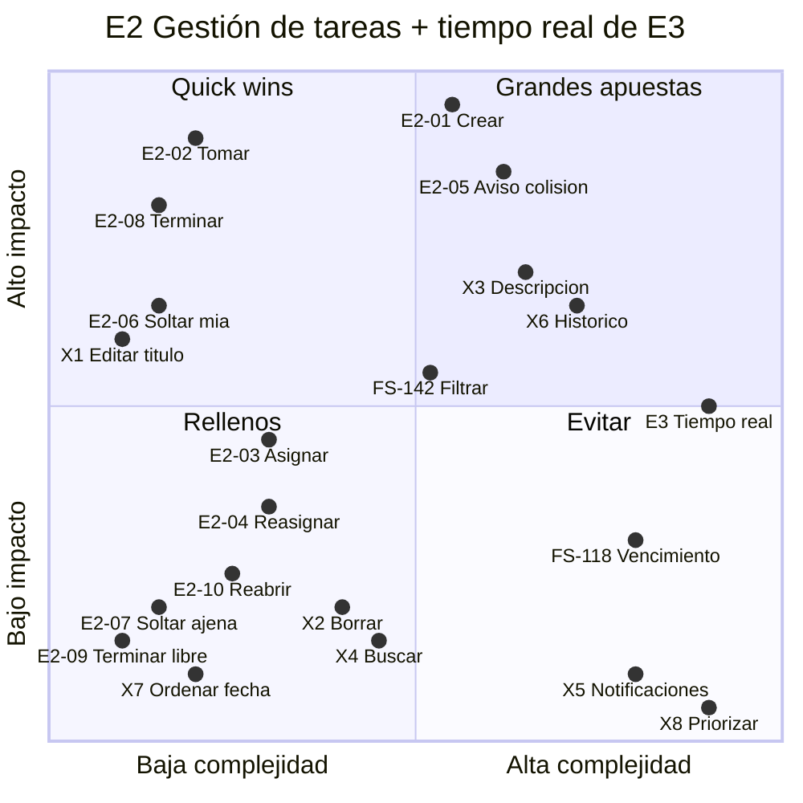

# E2 «Gestión de tareas»: priorización

Esta matriz enfrenta impacto y complejidad para todas las historias de E2, tanto las del MVP como las que quedaron fuera, y añade la sincronización en tiempo real de E3 «Actividad del equipo». Los identificadores HU-E2-nn y X-n corresponden al listado inicial de E2. FS-118 y FS-142 son las historias que ya tienen fichero en este backlog.

**Cómo se puntúa:**
- **Impacto:** cuánto ayuda la historia a las dos decisiones que el producto quiere cambiar (no pisar a otro y elegir lo que está libre) y a los riesgos del PRD (que el estado se quede viejo y que migrar salga caro). **No hay datos de usuarios**, porque el usuario de referencia es un caso de estudio, así que el impacto es un juicio.
- **Complejidad:** coste de construirla sobre el repo tal como está hoy. Ahora mismo no hay tareas, no hay tests en el frontend, no hay selector de fecha y no hay infraestructura de tiempo real.

## Matriz

⭐ = quick win (mucho impacto con poca complejidad). ⚠️ = depende de un punto abierto del PRD.

| Historia | MVP | Impacto | Complejidad | Por qué |
|---|---|---|---|---|
| **HU-E2-02** Tomar una tarea libre | ✅ | Alto | Baja | Es la decisión central del producto («esto es mío»). Una vez existen las tareas, es una sola acción. ⭐ **Quick win** |
| **HU-E2-08** Terminar una tarea en curso | ✅ | Alto | Baja | Cubre JTBD-4 y deja limpia la cola. Es una sola acción. ⭐ **Quick win** |
| **HU-E2-06** Soltar mi tarea | ✅ | Medio-alto | Baja | Es la forma honesta de decir «ya no estoy en esto», así que ataca directamente el riesgo #1 (estado viejo). ⭐ **Quick win** |
| **X1** Editar el título | ❌ | Medio-alto | Baja | Sin ella, cada errata acaba como una tarea «terminada» falsa, que ensucia la lista y desvirtúa el estado. El PRD ya la marca como primera ampliación. ⭐ **Quick win fuera del MVP** |
| **HU-E2-01** Crear una tarea | ✅ | Muy alto | Media | Sin tareas no hay producto. La complejidad es media porque es la **primera entidad** del repo: migración, modelo, API, UI y montar las suites de test (EXT-2). |
| **HU-E2-05** Aviso si otra persona ya la cogió | ✅ ⚠️ | Alto | Media-alta | Es lo que evita un episodio como el de los dos días perdidos. Exige detectar cambios simultáneos, y RF-12 sigue siendo una desviación sin aprobar. |
| **FS-142** Filtrar por estado | ✅ | Medio | Media | Con 3 a 10 personas la lista es corta al principio, pero crece porque no se pueden borrar tareas, y ahí el filtro *Pendientes* por defecto se vuelve necesario. Son siete tickets. |
| **HU-E2-03** Asignar a un compañero | ✅ | Medio | Baja-media | Sirve para repartir trabajo, aunque lo normal es que cada uno coja lo suyo. Necesita un selector de personas. |
| **X3** Descripción y comentarios | ❌ | Alto (si PA-1 se confirma) | Media-alta | Es el contexto que puede impedir que la migración llegue a hacerse (riesgo #2). Los comentarios cuestan bastante más que la descripción sola. |
| **X6** Histórico o rastro de cambios | ❌ | Medio-alto | Media-alta | Desbloquea PA-2 («qué se ha movido»), PA-3 (medir el hábito) y hace medible M-5. |
| **E3 Tiempo real** | ❌ | Medio | Alta | Hace que los cambios se vean antes, pero **no arregla un estado viejo**. En el repo no hay infraestructura para ello (ni websockets ni SSE). Era la promesa original («más en tiempo real»), así que cuenta como gran apuesta, no como relleno. |
| **HU-E2-04** Reasignar una tarea en curso | ✅ | Medio-bajo | Baja | Es un caso menos frecuente y arrastra el agujero de PA-8. |
| **HU-E2-10** Reabrir | ✅ ⚠️ | Bajo | Baja | Es poco frecuente y depende de PA-10. |
| **HU-E2-07** Soltar la tarea de otra persona | ✅ ⚠️ | Bajo o negativo | Baja | Puede *provocar* colisiones (PA-9). |
| **HU-E2-09** Terminar una tarea libre | ✅ ⚠️ | Bajo | Baja | Es un caso marginal que depende de PA-13. |
| **FS-118** Fecha de vencimiento | ✅ (decisión de producto) | Bajo-medio | Alta | No ayuda a ninguna de las dos decisiones del producto, tiene un ticket de talla L y arrastra el riesgo transversal de los husos horarios. **Cae en el cuadrante «evitar», pero sigue dentro del MVP** porque así lo decidió producto. |
| **X2** Borrar | ❌ | Bajo | Media | Marcar como terminada ya cubre el caso normal, y borrar exige confirmación. |
| **X4** Buscar o filtrar por responsable | ❌ | Bajo | Media | Con 3 a 10 personas no hace falta. |
| **X7** Ordenar por fecha de vencimiento | ❌ | Bajo | Baja | Choca con el orden estable de RF-22 y depende de FS-118. |
| **X5** Notificaciones | ❌ | Negativo | Alta | Va contra la idea de «un resumen que espera, no un aviso que interrumpe». |
| **X8** Priorizar y estimar | ❌ | Negativo | Alta | Un equipo que lo necesite no es nuestro usuario. |

## Orden del backlog

El orden sale de la matriz, **corregido por las dependencias**: una historia sin la que no existe nada va primero aunque no sea un quick win.

### MVP

1. **HU-E2-01 Crear una tarea.** Todo depende de ella. Incluye montar EXT-2.
2. ⭐ **HU-E2-02 Tomar**
3. ⭐ **HU-E2-08 Terminar**
4. ⭐ **HU-E2-06 Soltar mi tarea**

   Con estas cuatro historias ya se puede **validar la hipótesis central**: una persona entra, ve lo que está libre, se lo asigna y lo termina.
5. **HU-E2-05 Aviso de colisión**, si se aprueba RF-12. Es la historia que justifica el producto.
6. **HU-E2-03 Asignar a un compañero**
7. **FS-142 Filtrar por estado**
8. **HU-E2-04 Reasignar**
9. **FS-118 Fecha de vencimiento.** Va la última del MVP porque tiene la complejidad más alta y el impacto más bajo. Así además hay tiempo para cerrar PA-7.
10. **HU-E2-10, HU-E2-09 y HU-E2-07.** Están **bloqueadas** por PA-10, PA-13 y PA-9. Si esas decisiones no se toman, se quedan fuera sin que el MVP se resienta.

### Después del MVP (si la hipótesis se sostiene)

11. ⭐ **X1 Editar el título.** Si en la primera semana aparecen erratas (se nota en tareas «terminadas» que en realidad eran erratas), sube por delante de FS-118.
12. **X6 Histórico**
13. **E3 Tiempo real.** Solo cuando se haya demostrado que el estado se mantiene al día.
14. **X3 Descripción**, sin comentarios. Se decide con los datos de PA-1.
15. **X2, X7 y X4**, como relleno y solo si alguien las pide.

### No se hacen

**X5 Notificaciones** y **X8 Priorizar y estimar**: contradicen la propuesta de valor.

## Tensiones abiertas

- **FS-118 va contra la matriz.** Es la historia más cara del MVP y la que menos aporta a sus decisiones. Si hay que recortar para llegar a tiempo, es la primera candidata a pasar a una segunda iteración, por delante de cualquier quick win.
- **X1 es más barata y probablemente tiene más impacto que HU-E2-07, HU-E2-09 y HU-E2-10**, que sí están en el MVP. Cambiarlas por X1 mejoraría el MVP sin hacerlo más grande, pero eso modifica el alcance consensuado y lo tiene que decidir producto.
