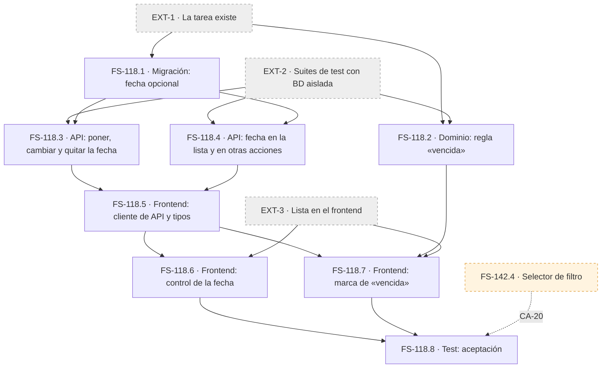

# FS-118: tickets

Historia: [FS-118 Fecha de vencimiento y tareas vencidas](us-fechas-vencimiento.md). Las convenciones, la Definition of Done por tipo y las dependencias externas (EXT-n) están en el [README del backlog](../README.md).

No hay ningún ticket de tipo **Bug**, porque todavía no hay nada construido.

## Resumen

| ID | Título | Tipo | Talla | Bloqueado por |
|---|---|---|---|---|
| **FS-118.1** | Añadir la fecha de vencimiento opcional a las tareas | Migración/DB | S | EXT-1 |
| **FS-118.2** | Regla de dominio «tarea vencida» | Modelo/Dominio | M | EXT-1, EXT-2 |
| **FS-118.3** | Poner, cambiar y quitar la fecha de una tarea | Endpoint/API | M | FS-118.1, EXT-2 |
| **FS-118.4** | La fecha en la lista y en el resto de acciones | Endpoint/API | M | FS-118.1, EXT-2 |
| **FS-118.5** | Cliente de API y tipos para la fecha | Frontend | S | FS-118.3, FS-118.4 |
| **FS-118.6** | Control para poner, cambiar y quitar la fecha desde la lista | Frontend | L | FS-118.5, EXT-3 |
| **FS-118.7** | Marca de «vencida» en la lista | Frontend | M | FS-118.2, FS-118.5, EXT-3 |
| **FS-118.8** | Verificación de aceptación de FS-118 | Test | M | FS-118.6, FS-118.7, FS-142.4 |

## Fichas

### FS-118.1: Añadir la fecha de vencimiento opcional a las tareas
- **Tipo:** Migración/DB
- **Capa:** migración y esquema generado
- **Hereda:** CA-4. Es la base de CA-1, CA-2 y CA-3.
- **Bloqueado por:** EXT-1
- **DoD propia:**
  - [ ] Las tareas que ya existen se quedan sin fecha y siguen funcionando.

### FS-118.2: Regla de dominio «tarea vencida»
- **Tipo:** Modelo/Dominio
- **Capa:** dominio
- **Hereda:** CA-5, CA-7, CA-8, CA-9, CA-10, CA-11, CA-12 y CA-14
- **Bloqueado por:** EXT-1, EXT-2
- **DoD propia:**
  - [ ] Hay un test por cada límite: la fecha es hoy, la fecha fue ayer, la tarea está Terminada, la tarea está Libre, la tarea no tiene fecha y la tarea se ha reabierto.
  - [ ] Hay un test con dos «hoy» distintos para la misma tarea (CA-14).
- ⚠️ **Hay que decidir antes de empezar:**
  - CA-14 depende de **PA-7**, que fija qué calendario manda.
  - Si la implementación pone la regla en el frontend para usar el calendario de quien mira, no hay runner donde ejecutar sus tests unitarios. En ese caso, o se añade un runner o esta DoD no se puede cumplir.

### FS-118.3: Poner, cambiar y quitar la fecha de una tarea
- **Tipo:** Endpoint/API
- **Capa:** validador, controlador, ruta y transformer
- **Hereda:** CA-1, CA-2, CA-3, CA-12, CA-15, CA-16 y CA-17
- **Bloqueado por:** FS-118.1, EXT-2
- **DoD propia:**
  - [ ] Hay tests para poner, cambiar y quitar la fecha.
  - [ ] Hay tests para una fecha pasada y para una fecha que no existe.
  - [ ] Hay un test con dos cambios seguidos, en el que se queda el último.

### FS-118.4: La fecha en la lista y en el resto de acciones
- **Tipo:** Endpoint/API
- **Capa:** transformer y los endpoints de tarea que ya existan
- **Hereda:** CA-4, CA-6, CA-18 y CA-19
- **Bloqueado por:** FS-118.1, EXT-2
- **DoD propia:**
  - [ ] Hay un test por cada acción (crear, tomar, asignar, soltar, terminar y reabrir) que comprueba que la fecha no cambia y que el orden de la lista se mantiene.

### FS-118.5: Cliente de API y tipos para la fecha
- **Tipo:** Frontend
- **Capa:** `src/lib/api.ts` y `src/lib/types.ts`
- **Hereda:** CA-15 y CA-16, en la parte de convertir los errores en mensajes en castellano
- **Bloqueado por:** FS-118.3, FS-118.4
- **DoD propia:**
  - [ ] La etiqueta del campo nuevo está en `FIELD_LABELS`.

### FS-118.6: Control para poner, cambiar y quitar la fecha desde la lista
- **Tipo:** Frontend
- **Capa:** la interfaz de la lista
- **Hereda:** CA-1, CA-2, CA-3, CA-4, CA-15, CA-16, CA-21 y CA-23
- **Bloqueado por:** FS-118.5, EXT-3
- **DoD propia:**
  - [ ] Si el guardado falla, el control vuelve a la fecha anterior y lo indica.
  - [ ] Todo el flujo se ha probado usando solo el teclado.
- ⚠️ **Es talla L**, así que incumple la regla de media jornada como máximo y hay que partirlo antes de planificarlo (ver [Estimación](#estimación)).

### FS-118.7: Marca de «vencida» en la lista
- **Tipo:** Frontend
- **Capa:** la interfaz de la lista
- **Hereda:** CA-5, CA-7, CA-8, CA-9, CA-10, CA-11, CA-13, CA-14, CA-20 y CA-22
- **Bloqueado por:** FS-118.2, FS-118.5, EXT-3
- **DoD propia:**
  - [ ] Se ha comprobado que la marca aparece con todos los filtros (CA-20).
  - [ ] La marca lleva texto o un icono con etiqueta, no solo color.

### FS-118.8: Verificación de aceptación de FS-118
- **Tipo:** Test
- **Capa:** toda la historia, de punta a punta
- **Hereda:** CA-1 a CA-23
- **Bloqueado por:** FS-118.6, FS-118.7 y **FS-142.4**. Para verificar CA-20 (las vencidas se ven con cualquier filtro) hace falta el selector de filtro de FS-142.
- **DoD propia:**
  - [ ] CA-14 se ha probado con dos navegadores en husos horarios distintos.
  - [ ] CA-17 se ha probado con dos sesiones que cambian la misma tarea casi a la vez.
  - [ ] CA-13 se ha probado dejando la lista abierta al pasar la medianoche, o simulando el cambio de día.

## Grafo de dependencias

Una flecha **A → B** significa que A bloquea a B. En gris están las dependencias externas; en naranja, la dependencia cruzada con FS-142.

## Orden de implementación

| Fase | Tickets | ¿En paralelo? | Por qué |
|---|---|---|---|
| **0: requisitos previos** | EXT-1, EXT-2 | Sí | Sin tareas y sin suites de test no se puede empezar. EXT-2 no tiene dueño y hay que asignarla ya. |
| **1: base** | FS-118.1 y FS-118.2 | Sí | La migración y la regla de dominio son independientes. FS-118.2 es la que más riesgo tiene por PA-7, así que conviene empezarla pronto. |
| **2: API** | FS-118.3 y FS-118.4 | Sí | Las dos dependen solo de FS-118.1. |
| **3: frontend base** | FS-118.5 | No | Es el cuello de botella de todo el frontend, pero es un ticket pequeño. |
| **4: UI** | FS-118.6 y FS-118.7 | Sí, siempre que EXT-3 esté hecha | FS-118.7 también necesita FS-118.2, que ya estará terminada desde la fase 1. |
| **5: verificación** | FS-118.8 | No | Además necesita FS-142.4 para poder verificar CA-20. |

**Camino crítico:** EXT-1 → FS-118.1 → FS-118.3 (o FS-118.4) → FS-118.5 → FS-118.6 (o FS-118.7) → FS-118.8. Son seis pasos en fila: el paralelismo evita que se alargue, pero no lo acorta.

**Puntos a vigilar:**
- **FS-118.2 no está en el camino crítico, pero es la que más probabilidades tiene de rehacerse si PA-7 cambia.** Por eso va en la fase 1.
- **Si EXT-3 no está terminada cuando acabe FS-118.5, se paran las fases 4 y 5.**
- **FS-118.8 depende de FS-142.** Hay que llevar FS-142 hasta FS-142.4 en paralelo, o cerrar FS-118 con CA-20 todavía sin verificar.

## Estimación

La talla mide la **incertidumbre y la amplitud** del trabajo, no horas:

| Talla | Qué la define |
|---|---|
| **S** | Un cambio acotado en una sola capa, siguiendo un patrón que **ya existe en el repo**, con pocos casos que probar. |
| **M** | Varias piezas o muchos casos de prueba, o la primera vez que se usa un patrón, pero sin incógnitas abiertas. |
| **L** | Algo que nunca se ha hecho en el repo, una decisión pendiente o una pieza que se sabe conflictiva. **Incumple la regla de media jornada como máximo y hay que partirlo.** |

**Qué hay hoy en el repo:**
- **Backend:** dos migraciones de ejemplo, validadores VineJS con `vine.create`, transformers y `serialize()`. VineJS 4 trae un esquema de fecha y Luxon está instalado.
- **Frontend:** el patrón de `lib/api.ts` y solo cinco componentes shadcn (`alert`, `button`, `card`, `input`, `label`). **No hay selector de fecha ni librería de fechas.**
- **Tests:** ninguno.

| Ticket | Talla | En qué se basa | Riesgo |
|---|---|---|---|
| **FS-118.1** | **S** | Un campo opcional más, igual que las migraciones que ya hay. El esquema se regenera solo. | 🟡 **Medio.** Hay que decidir cómo se guarda un día sin hora: si se hace mal, aparecen desfases de un día entre husos horarios que rompen CA-7 y CA-14. Además, `schema.ts` se regenera sin formato y el lint falla si no se pasa `format`. |
| **FS-118.2** | **M** | La lógica es pequeña, pero tiene muchos límites (hoy, ayer, Terminada, Libre, sin fecha, reabierta, dos husos) y serían los primeros tests unitarios del repo. | 🔴 **Alto.** Si PA-7 cambia, se rehace. Si la regla vive en el frontend, no hay runner para sus tests. **Pasa a L si PA-7 no se cierra antes.** |
| **FS-118.3** | **M** | Es el primer endpoint que escribe una fecha: validación, transformación y siete escenarios de test. El patrón validador + transformer ya existe. | 🟡 **Medio.** La API de fechas de VineJS 4 va por delante de su documentación (hay que comprobarla en los `.d.ts`), y al serializar un día sin hora como fecha y hora puede cambiar de día. |
| **FS-118.4** | **M** | Tocar el transformer es poco; lo que pesa es la batería de tests, uno por cada una de las seis acciones. | 🟡 **Medio.** Depende de cuántas de esas acciones existan ya. Si faltan, el ticket se cierra con tests pendientes. |
| **FS-118.5** | **S** | Una función y un tipo siguiendo el patrón exacto de `lib/api.ts`, más la etiqueta en `FIELD_LABELS`. | 🟢 **Bajo.** El formato de la fecha tiene que coincidir con el del backend, y FS-118.3 lo deja resuelto. |
| **FS-118.6** | **L** | No hay selector de fecha, así que hacen falta componentes nuevos y probablemente una dependencia. Además exige teclado (CA-23), castellano (CA-21) y marcha atrás si falla el guardado (CA-16). | 🔴 **Alto.** Los selectores de fecha accesibles son un punto conflictivo conocido, y este sería el primer patrón de actualización optimista del frontend. **Hay que partirlo:** (a) poner, cambiar y quitar la fecha, con el manejo de errores; (b) teclado y formato en castellano. El componente que se elija decide la talla: uno nativo del navegador la baja a M. |
| **FS-118.7** | **M** | Si la regla llega ya calculada, es un indicador visual (sería S). Si hay que calcularla en el cliente con el calendario de quien mira, es M. Todavía no se sabe cuál de los dos casos es. | 🟡 **Medio.** Depende de PA-7 y de dónde viva la regla. Además, CA-20 lo ata a FS-142. |
| **FS-118.8** | **M** | Son 23 criterios en manual, y tres de ellos necesitan preparar el entorno: dos husos horarios, la medianoche y dos sesiones simultáneas. | 🟡 **Medio.** Simular husos y la medianoche en el navegador es costoso, y los Bugs que salgan de aquí **no están estimados**. |

**Resumen:** 2 tickets S, 5 M y 1 L. La L (FS-118.6) hay que partirla antes de planificar.

**Riesgo transversal:** cómo se maneja un día sin hora cuando hay varios husos horarios. Afecta a cómo se guarda (FS-118.1), a la regla (FS-118.2), a la serialización (FS-118.3 y FS-118.5) y a cómo se muestra (FS-118.7). Un desfase de un día en cualquiera de esas capas rompe CA-7 y CA-14, y no se detecta hasta FS-118.8.

**Lo que más reduce el riesgo:** cerrar **PA-7** antes de la fase 1.

**Fuera de la estimación:** EXT-1, EXT-2 y EXT-3, y los Bugs que salgan de FS-118.8.

## Qué bloquea antes de construir

1. **Hay criterios [PROPUESTO] sin revisar:** CA-6, CA-10, CA-11, CA-12, CA-13, CA-15, CA-18, CA-19, CA-20, CA-21 y CA-22. Los tickets los heredan, y si se rechaza alguno, sale de su ficha.
2. **PA-7** afecta a FS-118.2, FS-118.7 y FS-118.8 (a través de CA-14).
3. **RF-17 del PRD** no dice que la fecha se guarde. Si se aprueba CA-6, hay que corregir el PRD.
4. **EXT-2 no tiene dueño.** Bloquea FS-118.2, FS-118.3 y FS-118.4.
