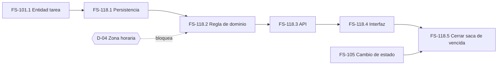

# Tickets de FS-118 - Fecha de vencimiento y tareas vencidas

Los tickets heredan la intención y los criterios de la historia. **No inventan negocio nuevo.** Nombran la capa afectada, pero no diseñan la implementación fina: eso vive en la spec de cambio.

## FS-118.1 · Persistencia de la fecha de vencimiento

**Tipo**: Datos · **Talla**: S · **Depende de**: FS-101.1

Añadir a la tarea el dato de fecha de vencimiento, opcional.

**Definition of Done**
- [ ] La migración es reversible
- [ ] No rompe migraciones anteriores ni datos existentes
- [ ] Las tareas ya creadas quedan sin fecha, no con una fecha inventada
- [ ] El esquema generado se regenera y se commitea

## FS-118.2 · Regla de dominio "vencida"

**Tipo**: Dominio · **Talla**: S · **Depende de**: FS-118.1

Implementar las cuatro reglas de negocio de la historia en **un único punto** del dominio.

**Definition of Done**
- [ ] La regla vive en un solo sitio, no repetida entre backend y frontend
- [ ] Cubre las reglas 1 a 4 de la historia, incluida la de que una tarea "hecha" no está vencida
- [ ] Test unitario para: fecha pasada, fecha de hoy, fecha futura, sin fecha, y vencida pero hecha
- [ ] La zona horaria queda resuelta según D-04, no elegida por defecto en silencio

**Bloqueado por D-04.** Este ticket no debería empezar antes de que producto decida la zona horaria.

## FS-118.3 · Exponer la fecha en la API

**Tipo**: API · **Talla**: S · **Depende de**: FS-118.2

Permitir asignar, modificar y quitar la fecha, y que la respuesta indique si la tarea está vencida.

**Definition of Done**
- [ ] Permite asignar, cambiar y eliminar la fecha
- [ ] Una fecha con formato inválido se rechaza con un error que dice qué campo falla
- [ ] La respuesta pasa por el transformer, no devuelve el modelo crudo
- [ ] El valor "vencida" lo calcula el dominio, no el cliente

## FS-118.4 · Fecha de vencimiento en la interfaz

**Tipo**: Frontend · **Talla**: M · **Depende de**: FS-118.3

Poner y quitar la fecha desde la tarea, y distinguir visualmente las vencidas en la lista.

**Definition of Done**
- [ ] Cubre CA-1, CA-2, CA-3, CA-4 y CA-6
- [ ] Lo vencido se distingue por algo más que el color, para no depender de la percepción cromática
- [ ] Un error de la API se muestra en pantalla, sin dejar el formulario en un estado ambiguo
- [ ] Sin errores en consola

## FS-118.5 · Cerrar una tarea la saca del estado vencido

**Tipo**: Frontend · **Talla**: S · **Depende de**: FS-118.4, FS-105

Cubrir CA-5, que cruza esta historia con la de cambio de estado.

**Definition of Done**
- [ ] Cubre CA-5
- [ ] Al pasar a "hecha", la marca de vencida desaparece sin recargar

## Grafo de dependencias

La cadena es casi enteramente secuencial. No hay nada que paralelizar salvo FS-105, que viene de otra historia.

## Nota sobre la estimación

Las tallas son un punto de partida para conversar, no un compromiso. Están puestas sin conocer la velocidad real del equipo, así que probablemente pequen de optimistas: es el sesgo habitual cuando estima quien no va a implementar.
