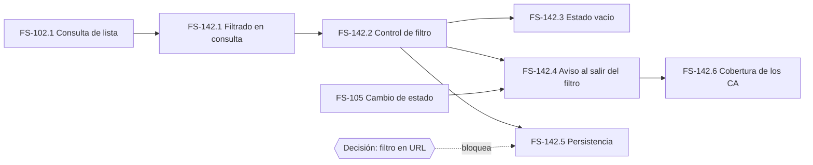

# Tickets de FS-142 - Filtrar la lista por estado

## FS-142.1 · Filtrado en la consulta de tareas

**Tipo**: API · **Talla**: S · **Depende de**: FS-102.1

Permitir pedir la lista de tareas restringida a un estado.

**Definition of Done**
- [ ] Sin filtro, devuelve todas las tareas, igual que antes
- [ ] Con un estado inválido, rechaza la petición y explica cuáles son válidos
- [ ] Filtrar no modifica ninguna tarea, cubre CA-4
- [ ] La respuesta mantiene la misma forma que la lista sin filtrar

**Decisión de implementación pendiente**: si el filtrado ocurre en servidor o en cliente. Con el volumen del supuesto 4 del PRD (decenas de tareas) el cliente basta, pero eso condiciona si el filtro es combinable con paginación más adelante. Va en la spec de cambio, no aquí.

## FS-142.2 · Control de filtro en la interfaz

**Tipo**: Frontend · **Talla**: M · **Depende de**: FS-142.1

Selector de estado sobre la lista, con "todas" por defecto.

**Definition of Done**
- [ ] Cubre CA-1 y CA-2
- [ ] El filtro activo es visible en todo momento, regla 4 de la historia
- [ ] Operable con teclado
- [ ] Sin errores en consola

## FS-142.3 · Estado vacío diferenciado

**Tipo**: Frontend · **Talla**: S · **Depende de**: FS-142.2

Distinguir "no hay tareas en este estado" de "el equipo no tiene ninguna tarea".

**Definition of Done**
- [ ] Cubre CA-3
- [ ] Los dos mensajes son distintos entre sí
- [ ] Desde el filtro sin resultados se puede quitar el filtro sin salir de la pantalla

Este ticket parece cosmético y no lo es. Sin él, un tablero recién creado y un filtro sin coincidencias se ven igual: una pantalla en blanco que parece un fallo.

## FS-142.4 · Una tarea que sale del filtro se avisa

**Tipo**: Frontend · **Talla**: S · **Depende de**: FS-142.2, FS-105

Cubrir CA-5.

**Definition of Done**
- [ ] Cubre CA-5
- [ ] Al cambiar de estado una tarea que deja de encajar en el filtro, el usuario recibe una indicación de que sigue existiendo
- [ ] La tarea no desaparece en silencio

## FS-142.5 · Persistencia del filtro

**Tipo**: Frontend · **Talla**: S · **Depende de**: FS-142.2

**Bloqueado.** No hay decisión de producto sobre si el filtro persiste al recargar ni si viaja en la URL.

Se deja el ticket creado y explícitamente bloqueado, en vez de omitirlo, porque el hueco es real y afecta al valor de la historia: el usuario principal coordina y comparte enlaces. Si se decide que no persiste, este ticket se cierra sin trabajo.

**Definition of Done**: pendiente de la decisión.

## FS-142.6 · Cobertura de los criterios de aceptación

**Tipo**: Test · **Talla**: S · **Depende de**: FS-142.4

**Definition of Done**
- [ ] Un caso de prueba por cada criterio, de CA-1 a CA-5
- [ ] Distingue los dos estados vacíos: sin tareas y sin resultados para el filtro
- [ ] Verifica que filtrar no altera ninguna tarea
- [ ] Los casos que dependen de la decisión de persistencia quedan declarados como pendientes

## Grafo de dependencias

A partir de FS-142.2 los tres tickets finales son paralelizables.
