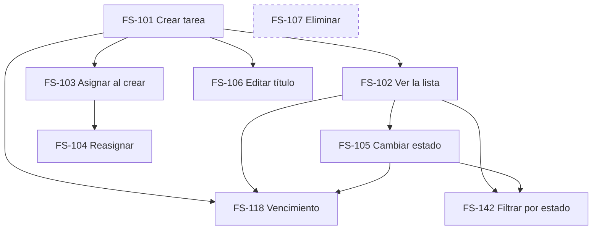

# Backlog de FlowSync

> Cadena completa: `estado-actual.md` -> `prd/alcance-mvp.md` -> `prd/flowsync-mvp.md` -> `backlog/`.
>
> El backlog vive **aquí primero**. Jira es la capa de seguimiento, no la fuente de verdad del comportamiento del sistema.
>
> Si Jira y estos ficheros divergen, gana el fichero hasta que una decisión humana lo cambie y lo versione.

## Estructura

```
docs/
  estado-actual.md          Mapa del repo antes de decidir nada
  prd/
    alcance-mvp.md          Discovery: el alcance defendible del MVP
    flowsync-mvp.md         PRD: qué construimos y por qué
  backlog/
    README.md               Este fichero: orden, matriz y grafo global
    E2-gestion-tareas/
      README.md             Las 9 historias de la épica e INVEST
      us-fechas-vencimiento.md          FS-118 enriquecida
      us-fechas-vencimiento.tickets.md  Tickets de FS-118
      us-filtrar-por-estado.md          FS-142 enriquecida
      us-filtrar-por-estado.tickets.md  Tickets de FS-142
```

## Convención de identificadores

`FS-nnn` para historias, `FS-nnn.n` para tickets. Es **convención interna**. En Jira viaja en el título y en las etiquetas, **nunca como clave**: Jira asigna las suyas y no se inventan.

## Matriz impacto / complejidad

| Historia | Impacto | Complejidad | Lectura |
|---|---|---|---|
| FS-101 Crear tarea | Alto | Baja | Sin esto no hay producto |
| FS-102 Ver la lista | Alto | Baja | Es el producto: el sitio donde se mira en vez de preguntar |
| FS-105 Cambiar estado | Alto | Baja | Sostiene la hipótesis del MVP. Es donde se gana o se pierde |
| FS-103 Asignar al crear | Alto | Baja | "Quién hace qué" es media pregunta original |
| FS-104 Reasignar | Medio | Baja | El trabajo cambia de manos, pero no a diario |
| FS-142 Filtrar por estado | Medio | Media | Gana valor con volumen. Con 12 tareas se ven todas |
| FS-118 Vencimiento | Medio | Media | Valioso, pero arrastra la decisión de zona horaria |
| FS-106 Editar título | Bajo | Baja | Los títulos se escriben mal, pero se sobrevive |
| FS-107 Eliminar | Bajo | Media | Sin decisión de producto. Borrado real o archivado no es lo mismo |

## Orden del backlog

Respeta dependencias y valor, no gusto.

1. **FS-101** Crear tarea
2. **FS-102** Ver la lista
3. **FS-103** Asignar responsable al crear
4. **FS-105** Cambiar estado en dos clics
5. **FS-104** Reasignar responsable
6. **FS-142** Filtrar por estado
7. **FS-118** Vencimiento y tareas vencidas
8. **FS-106** Editar título
9. **FS-107** Eliminar tarea · *bloqueada por decisión de producto*

Del 1 al 4 se obtiene un producto que ya valida la hipótesis: crear, ver, asignar y cambiar de estado. Todo lo demás mejora un producto que ya funciona.

FS-142 va antes que FS-118 aunque tengan impacto parecido, porque FS-118 está bloqueada por D-04 y arrancarla antes de esa decisión obliga a rehacer la regla de dominio.

## Grafo global de la épica



## Decisiones que bloquean trabajo

| Decisión | Bloquea | Responsable |
|---|---|---|
| **D-05 ¿Qué delimita "el equipo"?** | **Toda la épica.** Sin frontera, "las tareas del equipo" son las de cualquiera que se haya registrado | Producto |
| D-01 ¿"Bloqueada" es estado o atributo? | FS-105, FS-142 | Producto |
| D-02 ¿Tarea sin responsable? | FS-101, FS-103 | Producto |
| D-04 Zona horaria del vencimiento | FS-118.2 y todo lo que cuelga | Producto |
| D-06 ¿Eliminar es borrado o archivado? | FS-107 completa | Producto |
| ¿El filtro persiste y viaja en la URL? | FS-142.5 | Producto |

**D-05 es la primera.** Salió de la revisión adversarial del PRD y afecta a toda la épica: el registro de FlowSync es público, no hay tabla de equipos, y los roles están fuera de alcance. Combinando las tres cosas, hoy "el equipo" significa cualquiera que se haya dado de alta. Ninguna historia de E2 tiene sentido pleno hasta resolverlo. Ver `docs/prd/flowsync-mvp.md`, sección 10.

Ninguna la decide la IA.

## Sobre la estimación

Las tallas t-shirt de los ficheros de tickets son punto de partida para conversar, no compromiso. Se pusieron sin conocer la velocidad real del equipo, y ese es exactamente el escenario en el que una estimación asistida por IA peca de optimista.
