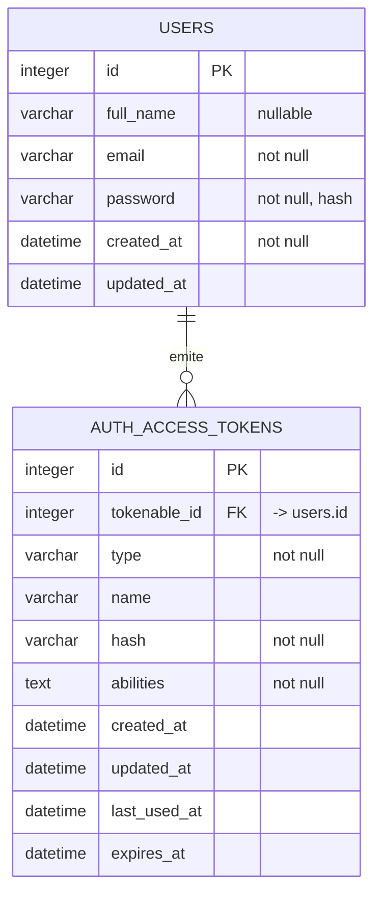

# FlowSync - Mapa del estado actual

> Fotografía del repositorio **antes** de decidir nada de producto. No propone cambios: describe lo que hay.
>
> Es el primer artefacto de la cadena SDD y antecede al alcance del MVP. Su función es impedir que el PRD reinvente capacidades que ya existen o dé por hecho un modelo de datos que no está.
>
> Rama de referencia: `s3/start`. Verificado leyendo el código y la base de datos, no de memoria.
>
> El PRD y el backlog de esta rama son los del curso, no los del Módulo 2. Aquellos viven en la rama `docs/alcance-mvp`.

## Qué es este repo

Monorepo sin workspaces ni `package.json` raíz. Dos proyectos npm independientes:

| Proyecto | Stack | Puerto |
|---|---|---|
| `backend/` | AdonisJS 7 + Lucid 22 + SQLite | 3333 |
| `frontend/` | React 19 + Vite 8 + Tailwind 4 + shadcn/ui | 5173 |

TypeScript de punta a punta, ESM en ambos lados.

## Capacidades que ya existen

**Solo autenticación.** No existe ningún dominio de negocio.

| Capacidad | Estado |
|---|---|
| Registro de cuenta | Implementado |
| Inicio de sesión con token | Implementado |
| Consulta de perfil propio | Implementado |
| Cierre de sesión con revocación de token | Implementado |
| Tareas | **No existe** en ninguna capa |
| Equipos | **No existe** en ninguna capa |
| Tableros o proyectos | **No existe** en ninguna capa |
| Roles y permisos | **No existe** |
| Registro de actividad | **No existe** |

## Modelo de datos actual



Dos tablas, dos migraciones. Eso es todo el modelo.

Nota sobre `full_name`: es nullable en base de datos y `.nullable()` en el validador, que **no** es lo mismo que opcional. La clave debe viajar siempre en el payload, aceptando `null` como valor.

## API expuesta

Todas las rutas bajo `/api/v1`.

| Método | Ruta | Controlador | Auth |
|---|---|---|---|
| POST | `/auth/signup` | `NewAccountController.store` | No |
| POST | `/auth/login` | `AccessTokensController.store` | No |
| GET | `/account/profile` | `ProfileController.show` | Sí |
| POST | `/account/logout` | `AccessTokensController.destroy` | Sí |

Cuatro endpoints. Ninguno de negocio.

**Detalle que rompe la regularidad**: `/account/logout` es el único que **no** pasa por `ctx.serialize()`. Devuelve el objeto plano en vez de envolverlo en `{ data: ... }` como el resto. Cualquier cliente que use un desenvolvedor genérico obtiene `undefined` en silencio.

## Estructura del backend

```
backend/app/
├── controllers/      3 ficheros, solo auth
├── middleware/       4: auth, silent_auth, force_json_response, container_bindings
├── models/           1: user.ts
├── transformers/     1: user_transformer.ts
├── validators/       1: user.ts (signup y login)
└── exceptions/       1: handler.ts
```

Flujo de una petición: ruta → controller → validator (VineJS) → model (Lucid) → transformer → `serialize()`.

Tres convenciones que condicionan cualquier cambio futuro:

1. **`database/schema.ts` es autogenerado** desde las migraciones. Los modelos no declaran columnas: extienden la clase generada vía `compose()`. Se regenera con `node ace migration:run`.
2. **`backend/.adonisjs/` está commiteado**, no ignorado. Es codegen de controladores y del registro tipado Tuyau.
3. **Toda respuesta pasa por `ctx.serialize()`**, que envuelve en `{ data: ... }`. Salvo logout.

## Estructura del frontend

```
frontend/src/
├── auth/          4: context, provider, use-auth, use-auth-form
├── components/    3 propios + 5 de shadcn/ui en ui/
├── lib/           3: api.ts, types.ts, utils.ts
├── pages/         3: login, register, profile
└── routes/        3: app-routes, protected-route, public-only-route
```

Tres páginas, todas de autenticación. Ninguna de producto.

`lib/api.ts` es el único punto de contacto con el backend: desenvuelve el `{ data }`, adjunta el `Authorization: Bearer` y traduce los errores del backend, que llegan en inglés, a castellano con desglose por campo.

El token vive en `localStorage` bajo la clave `flowsync.token`, y se rehidrata contra `GET /account/profile` al arrancar. Es **deuda conocida**: accesible desde JavaScript y por tanto vulnerable a XSS.

## Verificación y calidad

| | backend | frontend |
|---|---|---|
| Lint | eslint | **oxlint**, no eslint |
| Typecheck | `npm run typecheck` | dentro de `npm run build` |
| Formato | Prettier (`@adonisjs/prettier-config`) | Prettier (`.prettierrc.json`) |
| Tests | Japa configurado, **cero ficheros de test** | **sin runner instalado** |

`npm test` en el backend responde `NO TESTS EXECUTED`. Las suites `unit` y `functional` están declaradas en `adonisrc.ts` pero sus directorios no existen.

**No hay ni una sola prueba automatizada en el proyecto.** Es el hueco de calidad más grande del repo actual.

> **Nota posterior.** Lo anterior describe el repo tal como estaba en el Módulo 2. Lo resolvió el cambio `add-test-foundation` del Módulo 3: ver H-01 y H-02 en `hallazgos.md`.

## Hallazgos relevantes para decidir producto

Cuatro cosas que el mapa revela y que condicionan el PRD:

**1. No hay frontera de equipo.** El registro es público: cualquiera con un email se da de alta. No hay tabla de equipos ni pertenencia. Sin roles ni permisos, todos verían todo. Hablar de "las tareas del equipo" no tiene soporte en el sistema actual. Es el origen de la decisión abierta **D-05**.

**2. El dominio de negocio está vacío.** Todo lo que sea tarea, estado, responsable o vencimiento se construye de cero. No hay nada que extender.

**3. No hay tests.** Cualquier cambio en el dominio se valida a mano hasta que se instale infraestructura de pruebas.

**4. El stack va por delante de la documentación conocida.** AdonisJS 7, Lucid 22, VineJS 4, TypeScript 6, React 19, Vite 8, react-router 8. Varias APIs difieren de versiones anteriores, así que conviene comprobar los `.d.ts` reales antes de asumir una firma.

## Hallazgos derivados

Los problemas técnicos concretos que salieron de este mapa y del trabajo posterior están recogidos en [`hallazgos.md`](hallazgos.md), cada uno con la forma en que se verificó. Los dos de severidad alta afectan directamente al Módulo 3: los tests comparten base de datos con desarrollo, y no existe ni una prueba automatizada.

## Qué NO decide este documento

Nada. Es un mapa, no una propuesta.

Las decisiones de producto viven en `docs/prd/alcance-mvp.md` y `docs/prd/flowsync-mvp.md`, que se escribieron después y a partir de esto.
